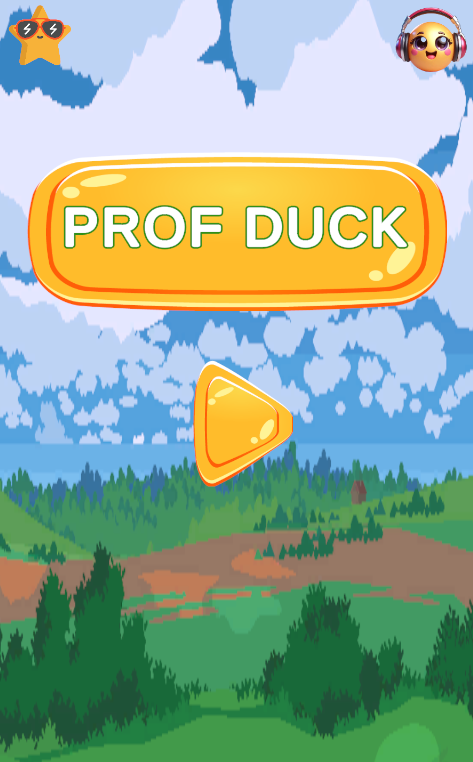
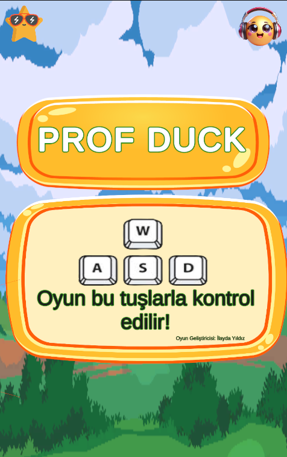
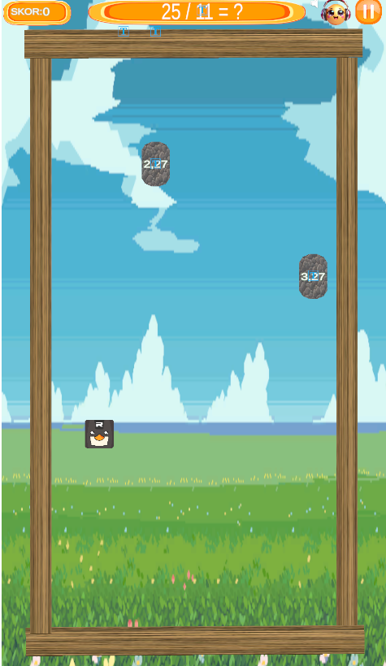
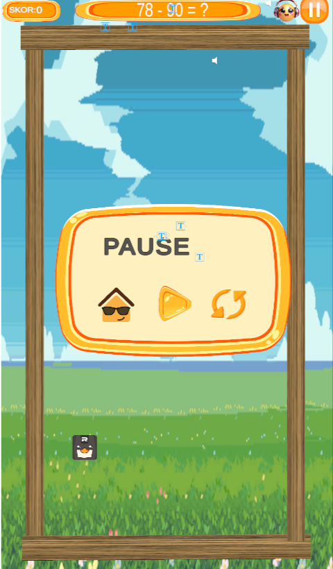
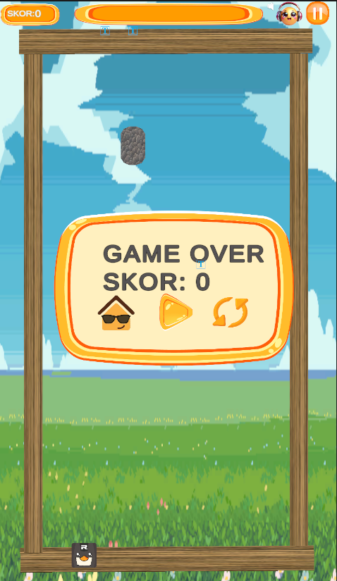

# Prof-Duck-Oyunu
# Oyunun Amacı 
İşletmelerin işe alım departmanlarındaki iş yükünü azaltmak için geliştirilmiş bir oyundur. Oyunun nihai amacı işletmenin ihtiyaç duyduğu dikkat, hafıza ve hesap özelliklerini bireylerde ölçmektir. Oyuncular, ördeği kontrol ederken matematiksel sorunları çözmeli  ve engellere,yanlış cevabın olduğu yumurtaya ve kendi yavrularına çarpmadan doğru cevabın olduğu yumurtayı toplamalıdır. Böylelikle Prof Duck yavrularına kavuşur.  

